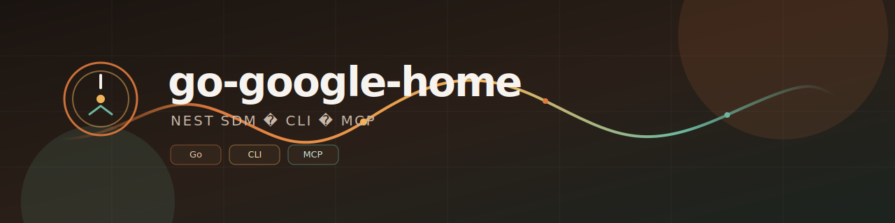

<p align="center">
  
</p>

# go-google-home-mcp

Go CLI + **MCP server** for [Google Nest](https://developers.google.com/nest/device-access) via the **Smart Device Management (SDM)** API.

Same shape as [shotah/go-garmin](https://github.com/shotah/go-garmin): static binary, stdio MCP, OAuth session on disk with **auto token refresh + persist**.

```bash
ghome login          # browser OAuth → session.json
ghome devices        # list Nest devices
ghome mcp            # MCP for Claude / Cursor / ZeroClaw
```

> **Scope:** Device Access covers **Nest hardware** (thermostats, cams, doorbells, Hub Max) — not third-party Google Home devices (Kasa, Mysa, Matter plugs, etc.). See [Limits](#limits).

## Features

- Partner Connections Manager (PCM) OAuth login + refresh token persistence
- List / get devices, structures, and rooms
- Thermostat mode, setpoints (°C), eco, and fan timer
- Compact MCP tools for LLM assistants
- Endpoint checklist in [`ENDPOINTS.md`](ENDPOINTS.md)

## MCP tools

| Tool | Description |
|---|---|
| `list_devices` | Compact device list (id, type, room, temp, mode) |
| `get_device` | Full SDM traits for one device |
| `list_structures` | Homes / structures |
| `get_structure` | One structure by id |
| `list_rooms` | Rooms in a structure |
| `get_room` | One room by structure + room id |
| `set_thermostat_mode` | `HEAT` / `COOL` / `HEATCOOL` / `OFF` |
| `set_thermostat_temperature` | Heat and/or cool setpoints (°C) |
| `set_thermostat_eco` | `MANUAL_ECO` / `OFF` |
| `set_fan_timer` | Fan `ON` / `OFF` (optional duration) |

## Installation

### Prerequisites

- Go 1.25+ ([install Go](https://go.dev/doc/install))
- A [Device Access](https://console.nest.google.com/device-access) project ($5 one-time) linked to a Google Cloud OAuth client

### Install CLI

```bash
go install github.com/shotah/go-google-home-mcp/cmd/ghome@latest
ghome --version
```

### Build from source

```bash
git clone https://github.com/shotah/go-google-home-mcp.git
cd go-google-home-mcp
make build
./ghome --help
```

## Setup (one-time)

1. **Google Cloud** → enable [Smart Device Management API](https://console.cloud.google.com/apis/library/smartdevicemanagement.googleapis.com).
2. Create an **OAuth client** (Desktop or Web) with redirect URI:
   `http://127.0.0.1:8787/oauth/callback`
3. **[Device Access Console](https://console.nest.google.com/device-access)** → create a project, link the OAuth client, copy the **Project ID** (UUID).
4. Login:

```bash
export GHOME_CLIENT_ID=...
export GHOME_CLIENT_SECRET=...
export GHOME_PROJECT_ID=...   # Device Access project id (UUID)

ghome login
# open the printed URL, approve Nest access
```

Session path:

| OS | Path |
|----|------|
| Linux / macOS | `~/.config/ghome/session.json` (or `$XDG_CONFIG_HOME/ghome/session.json`) |
| Windows | `%AppData%\ghome\session.json` |
| Docker / ZeroClaw | `HOME=/zeroclaw-data` → `/zeroclaw-data/.config/ghome/session.json` |

Access tokens refresh automatically; rotated tokens are written back to `session.json`.

## CLI

```bash
ghome devices
ghome structures
ghome structures get --structure STRUCTURE_ID
ghome rooms --structure STRUCTURE_ID
ghome rooms --structure STRUCTURE_ID --room ROOM_ID
ghome thermostat mode --device DEVICE_ID --mode COOL
ghome thermostat temp --device DEVICE_ID --cool 22
ghome thermostat eco --device DEVICE_ID --mode MANUAL_ECO
ghome thermostat fan --device DEVICE_ID --mode ON --duration 1h
ghome logout
```

## MCP (ZeroClaw / Claude / Cursor)

```toml
[[mcp.servers]]
name = "google-home"
transport = "stdio"
command = "ghome"
args = ["mcp"]

[mcp_bundles.google-home]
servers = ["google-home"]
```

Mount `secrets/ghome` → `/zeroclaw-data/.config/ghome` and set `HOME=/zeroclaw-data`.

## Build / release

```bash
make build
make test
make check          # fmt + lint + test
make release        # bump VERSION, tag, push → GoReleaser
# or: make release BUMP=minor
# or: make release TAG=v0.1.0
```

GitHub Actions:
- **CI** on push/PR to `main` — build, golangci-lint, test
- **Release** on `v*` tags — GoReleaser publishes linux/darwin/windows binaries

## Limits

- **Nest only** — SDM does not expose Kasa, Mysa, Matter lights/plugs, or other Google Home partners. For those, use [Home Assistant](https://www.home-assistant.io/) (or brand APIs). Google’s broader [Home APIs](https://developers.home.google.com/apis) are mobile SDKs (Android/iOS), not a server REST API.
- Camera WebRTC/RTSP and event images — trait exists; not wired (by design for now).
- Pub/Sub event streaming — not implemented.

Full API surface and status: [`ENDPOINTS.md`](ENDPOINTS.md).

## License

Apache-2.0
